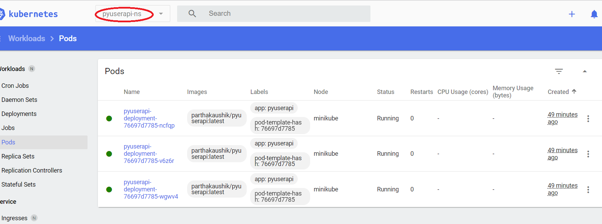

#  DevOps 

## Goal

Build and deploy the included application
using Kubernetes

## App code edits / adds
Added an ini file for uWSGI: **uwsgi.ini**  
Added a **startup.sh** script to be invoked by the **CMD** directive in the Dockerfile  
Edited **userapi.py** to remove hardcoded mysql username  
*Note that db_root_user and db_root_password are supplied as Kubernetes secrets.*

## Docker
See **Dockerfile** for details  
**Build, tag, push:**   
`docker build . -t parthakaushik/pyuserapi --build-arg MYSQL_PORT=3306 --build-arg DB_NAME="userapi_db"`  

$ docker push parthakaushik/pyuserapi:latest  
The push refers to repository [docker.io/parthakaushik/pyuserapi]  
a4956a0c7fb8: Pushed  
bcffbfd8f9a7: Pushed   

**Stand-up the container locally**  
```
$ docker run -d -p 127.0.0.1:3001:80/tcp parthakaushik/pyuserapi
e57b54d4b8d2b55e89e8aec375c3e4ebcc1c78c22b813f5f9024e7a2452d92c3

parth@parth_2023 MINGW64 ~/plotly-project/python-flask (master)
$ docker ps
CONTAINER ID   IMAGE    COMMAND       CREATED    STATUS   PORTS    NAMES  
e57b54d4b8d2   parthakaushik/pyuserapi  "./startup.sh" 47 min ago   Up 47 min   127.0.0.1:3001->80/tcp    upbeat_kowalevski  
df0a98adfeb2   gcr.io/k8s-minikube/kicbase:v0.0.40   "/usr/local/bin/entr…"   33 hours ago     Up 33 hours     127.0.0.1:49757->22/tcp, 127.0.0.1:49758->2376/tcp, 127.0.0.1:49760->5000/tcp, 127.0.0.1:49756->8443/tcp, 127.0.0.1:49759->32443/tcp   minikube  

```

## minikube 
Installed **minikube** om my laptop  
Obtained the dashboard url:  

```  
minikube dashboard --url  
C:\Users\parth>* Verifying dashboard health ...  
* Launching proxy ...  
* Verifying proxy health ...  
http://127.0.0.1:51270/api/v1/namespaces/kubernetes-dashboard/services/http:kubernetes-dashboard:/proxy/  
```  
Created a new namespace **pyuserapi-ns**   


## Deployment  
Created **pyuserapi-secrets.yml**  
Created **pyuserapi-deployment.yml**  
Applied:  
```  
$ kubectl -n pyuserapi-ns apply -f pyuserapi-secrets.yml  
secret/pyuserapi-secrets created  

$ kubectl -n pyuserapi-ns get secrets  
NAME                TYPE     DATA   AGE  
pyuserapi-secrets   Opaque   2      21s  

$ kubectl -n pyuserapi-ns apply -f puserapi-deployment.yml  
deployment.apps/pyuserapi-deployment created  

```

## View


